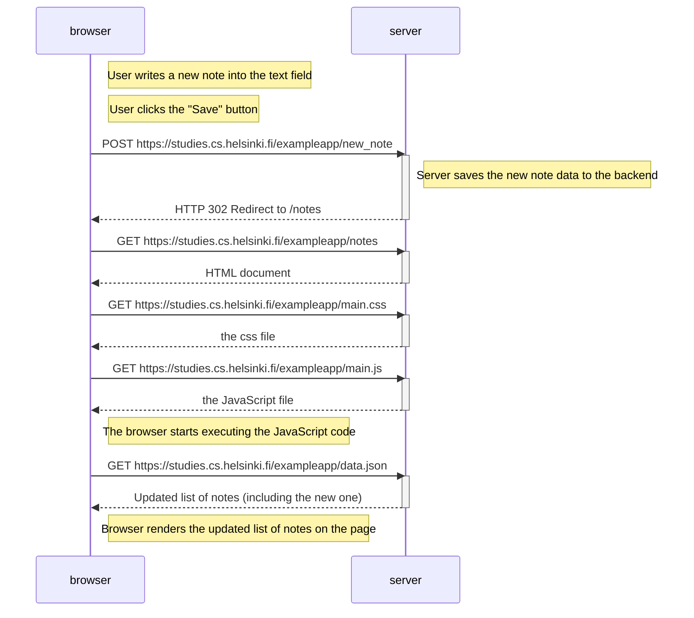
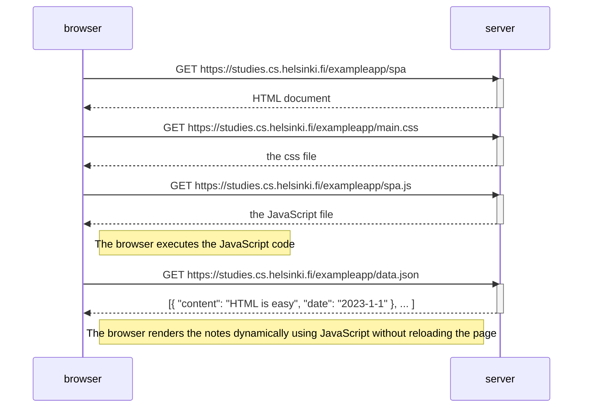

## 0.4: New note diagram


## 0.5: Single page app diagram


## 0.6: New note in Single page app diagram
 ```mermaid
sequenceDiagram
    participant browser
    participant server

    Note right of browser: User writes a new note in the text field and clicks "Save"

    Note right of browser: JavaScript intercepts the form submission and sends the note using fetch

    browser->>server: POST https://studies.cs.helsinki.fi/exampleapp/new_note_spa
    activate server
    server-->>browser: 200 OK (no redirect)
    deactivate server

    Note right of browser: JavaScript adds the new note to the list and updates the DOM dynamically without reloading the page
```
